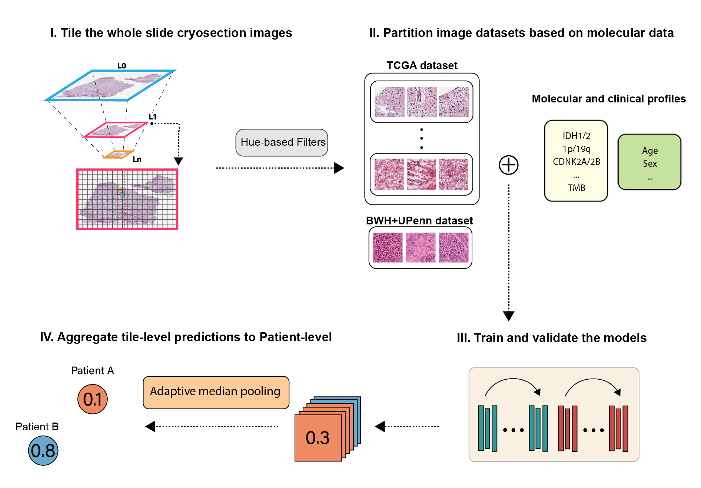

# CHARM: Cryosection Histopathology Assessment and Review Machine (TBD) 

## Pre-requisites:
* Linux (Tested on Ubuntu 18.04)
* NVIDIA GPU (Tested on Nvidia GeForce RTX 6000/8000/2080Ti)
* Python (3.7).
* Check requirement.txt under pytorch and tf folders respectively for other dependences. 

### Data Preparation
For each cryosection whole slide image, we tiled it in 1000 by 1000 pixels with 50% overlapping in both x and y directions using [level 0] 40x magnification. 
